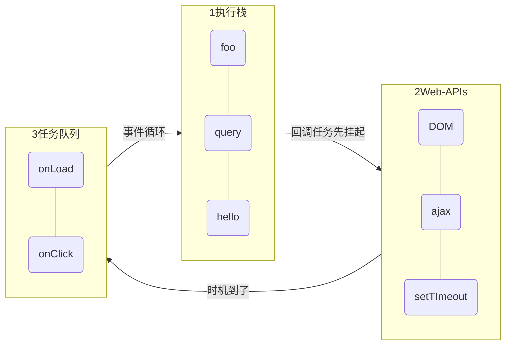
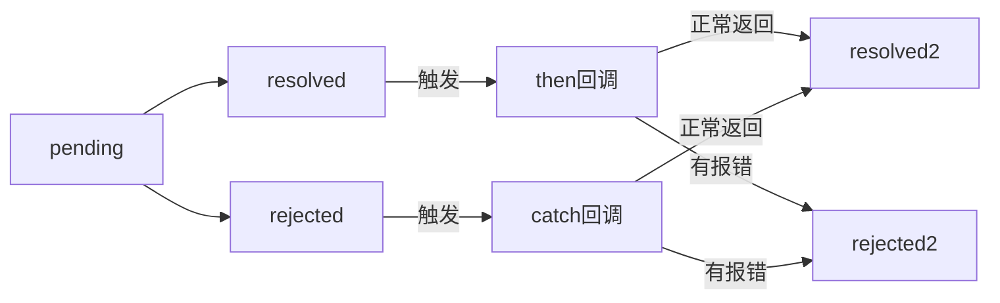
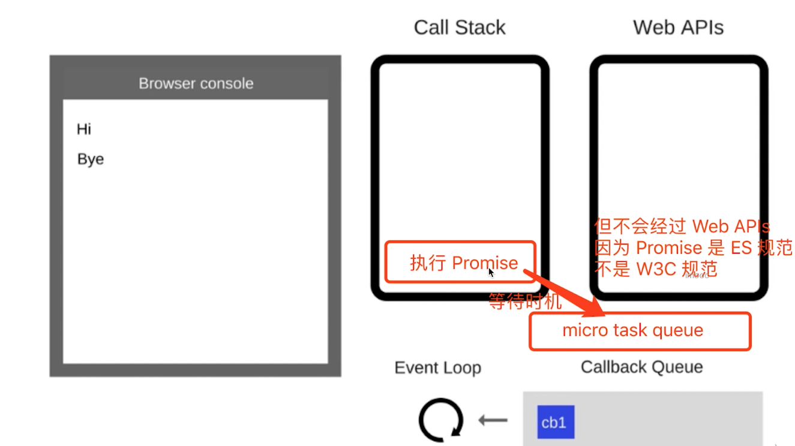
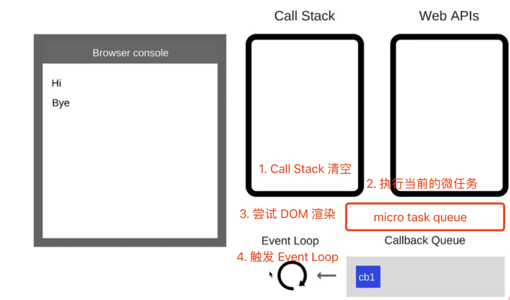
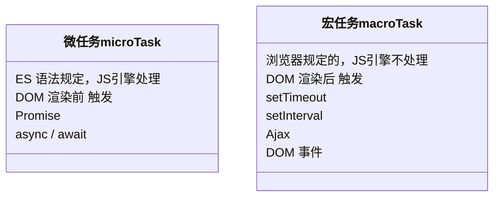

# JS基础知识（规定语法 ECMA262标准）

## 1.变量类型和计算

题目：

1. typeof能判断哪些类型？
2. 何时使用 === 何时使用 == ？
3. 值类型和引用类型的区别？
4. 手写深拷贝

知识点：

1. 值类型和引用类型
2. typeof运算符
3. 深拷贝
4. 字符串拼接
5. ==
6. if语句和逻辑运算

### 1.1 值类型和引用类型

#### 1.1.1 值类型

```js
//值类型
let a = 100
let b = a
a = 200
console.log(b) //200
```


常见的值类型：

```js
let a   // undefined
const s = 'abc'
const n = 100
const b = true
const s = Symbol('s')
```

#### 1.1.2 引用类型

```js
//引用类型
let a = { age: 20}
let b = a
b.age = 21
console.log(a.age) //21
```


常见引用类型

```js
const obj = { x: 100 }
const arr = ['a', 'b', 'c']

const n = null // 特殊引用类型，指针指向为空地址

function fn() {} //特殊引用类型，但不用于存储数据，所有没有“拷贝、复制函数”，这一说
```

### 1.2 typeof运算符

- 识别所有的值类型
- 识别函数
- 判断是否为引用类型（不可再细分）

```js
//判断所有值类型
let a;                      typeof a // 'undefined'
const str = 'abc'           typeof str // 'string'
const n = 100               typeof n // 'number'
const b = true              typeof b // 'boolean'
const s = Symbol('s')       typeof s // 'symbol'

//能判断函数
typeof console.log   // 'function'
typeof function(){}  // 'function'

//能识别引用类型（不可再细分）
typeof null       // 'object'
typeof ['a','b']  // 'object'
typeof { x:100}   // 'object'
```

### 1.3 深拷贝

- 注意判断值类型和引用类型
- 注意判断是数组还是对象
- 递归

```js
const obj1 = {
    age: 20,
    name: 'xxx',
    address: {
        city: 'beijing'
    },
    arr: ['a', 'b', 'c']
}

const obj2 = deepClone(obj1)
obj2.address.city = 'shanghai'
obj2.arr[0] = 'a1'
console.log(obj1.address.city)
console.log(obj1.arr[0])

/**
 * 深拷贝
 * @param {Object} obj 要拷贝的对象
 */
function deepClone(obj = {}) {
    if (typeof obj !== 'object' || obj == null) {
        // 1.obj 是 null ，或者不是对象和数组，直接返回
        return obj
    }

    // 2.初始化返回结果
    let result
    if (obj instanceof Array) {
        result = []
    } else {
        result = {}
    }

    for (let key in obj) {
        // 保证 key 不是原型的属性
        if (obj.hasOwnProperty(key)) {
            // 3.递归调用！！！
            result[key] = deepClone(obj[key])
        }
    }

    // 返回结果
    return result
}
```

### 1.4 字符串拼接

```js
const a = 100 + 10  //110
const b = 100 + '10'  //'10010'
const c = true + '10'  //'true10'
```

### 1.5 ==

```js
100 == '100'  //true
0 == ''  //true
0 == false  //true
false == ''  //true
null == underfined  //true

// 除了 == null 之外，其他都一律用 ===

const obj = { x: 100 }
if(obj.a == null){}
// 相当于
// if(obj.a === null || obj.a === undeined){}
```

### 1.6 if语句和逻辑运算

- truely变量：!!a === true 的变量
- falsely变量：!!a === false 的变量  
(以下为falsely变量，其他都是truely变量)
    1. !! 0
    2. !! NaN
    3. !! ''
    4. !! null
    5. !! undefined
    6. !! false

```js
// if 判断
// turly 变量
const a = true
if (a) {
    // ...
}
const b = 100
if (b) {
    // ...
}

// falsely 变量
const c = ''
if (c) { 
    // ...  不会执行
}
const d = null
if (d) {
    // ...  不会执行
}
let e
if (e) {
    //...  不会执行
}
```

```js
// 逻辑判断
console.log(10 && 0)    //0
console.log('' || 'abc') // 'abc'
console.log(!window.abc) // true
```

## 2.原型和原型链

题目：

1. 如何准确的判断一个变量是不是数组？
2. 手写一个简易的jQuery，考虑插件和扩展性
3. class的原型本质，怎么理解?

知识点：

1. class 和继承
2. 类型判断 instanceof
3. 原型和原型链

### 2.1 class 和继承

#### 2.1.1 class

- construtor
- 属性
- 方法

```js
// 创建一个类 Student
class Student {
    constructor(name, number) {
        this.name = name
        this.number = number
        // this.gender = 'male'
    }
    sayHi() {
        console.log(
            `姓名 ${this.name} ，学号 ${this.number}`
            // ES5写法： '姓名 ' + this.name + ' ，学号 ' + this.number
        )
    }
    // study() {}
}

// 通过类 new 对象/实例
const xialuo = new Student('夏洛', 100)
console.log(xialuo.name)
console.log(xialuo.number)
xialuo.sayHi()

const madongmei = new Student('马冬梅', 101)
console.log(madongmei.name)
console.log(madongmei.number)
madongmei.sayHi()
```

#### 2.1.2 继承

- extends
- super
- 扩展或重写方法

```js
// 父类 People
class People {
    constructor(name) {
        this.name = name
    }
    eat(){
        console.log(`${this.name} eat something`)
    }
}
// 子类 Student
class Student extends People{
    constructor(name,number) {
        super(name)
        this.number = number
    }
    sayHi() {
        console.log(
            `姓名 ${this.name} ，学号 ${this.number}`
        )
    }
}
// 子类 Teacher
class Teacher extends People{
    constructor(name,major){
        super(name)
        this.major = major
    }
    teach(){
        console.log(`${this.name} 教授 ${this.major}`)
    }
}
// 通过类 new 对象/实例
const xialuo = new Student('夏洛', 100)
console.log(xialuo.name)
console.log(xialuo.number)
xialuo.sayHi()
xialuo.eat()

const wanglaoshi = new Teacher('王老师','语文')
console.log(wanglaoshi.name)
console.log(wanglaoshi.major)
wanglaoshi.teach()
wanglaoshi.eat()
```

### 2.2 类型判断 instanceof

```js
xialuo instanceof Student  // true
xialuo instanceof People  // true
xialuo instanceof Object  // true

[] instanceof Array // true
[] instanceof Object // true

{} instanceof Object // true
```

### 2.3 原型和原型链

#### 2.3.1 原型

```js
// class 实际上是函数，可见是语法糖
typeof Pepole // 'function'
typeof Student // 'function'

//隐式原型和显式原型
console.log( xialuo.__proto__)
console.log( Student.prototype)
console.log( xialuo.__proto__ === Student.prototype ) //true
```


原型关系

- 每个class都有**显示原型** prototype
- 每个实例都有**隐式原型** `__proto__`
- 实例的`__proto__`指向对应class的 prototype

基于原型的执行规则

- 获取属性xialuo.name 或执行方法xialuo.sayHi()时
- 先在自身属性和方法去找
- 如果找不到则自动去 `__proto__` 找

#### 2.3.2 原型链

```js
console.log( Student.prototype.__proto__)
console.log( Prople.prototype )
console.log( Prople.prototype === Student.prototype.__proto__ ) //true
```


```js
// hasOwnProperty 查看是否为自身属性或方法
xialuo.hasOwnProperty('name')  //true
xialuo.hasOwnProperty('sayHi')  //false
```


> important tips ‼️

- class 是ES6语法规范，由ECMA委员会发布
- ECMA只规定语法规则，即我们代码的书写规范，不规定如何实现
- 以上实现方式都是V8引擎的实现方式，也是主流的

## 3. 作用域和闭包

题目：

1. this的不同应用场景，如何取值？
2. 手写bind函数 [a](./3.2-%E6%89%8B%E5%86%99bind.js)
3. 实际开发中闭包的应用场景，举例说明 [a](./a-3.3-%E9%97%AD%E5%8C%85%E5%BA%94%E7%94%A8%E5%9C%BA%E6%99%AF.js)
4. 找到代码中错误的地方

```js
// 4. 创建10个a标签，点击的时候弹出对应的序号
let i,a                               
for (i = 0; i < 10; i++) {
    a = document.createElement('a')
    a.innerHTML = i + '<br>'
    a.addEventListener('click', function (e) {
        e.preventDefault()
        alert(i)
    })
    document.body.appendChild(a)
}
```

知识点：

1. 作用域和自由变量
2. 闭包
3. this

### 3.1 作用域和自由变量


作用域：

- 全局作用域
- 函数作用域
- 块级作用域（ES6）

```js
// ES6 块级作用域
if (true) {
    let x = 100
}
console.log(x)  //会报错
```

自由变量：

- 一个变量在当前作用域没有定义，但被使用了
- 向上级作用域，一层一层依此寻找，直到找到为止
- 如果全局作用域都没找打，则会报错 xx is not defined

### 3.2 闭包

- 作用域应用的特殊情况，有两种表现：
- 1.函数作为参数被传递
- 2.函数作为返回值被返回

```js
// 1.函数作为参数
function print(fn) {
    let a = 200
    fn()   //函数执行的地方
}
let a  = 100
function fn () {   //函数定义的地方
    console.log(a)
}
print(fn) //100

//2.函数作为返回值被返回
function create() {
    let a = 100
    return function () {  //函数定义的地方
        console.log(a)
    }
}
let fn = create() //函数执行的地方
let a = 200
fn()  //100

// 所有的自由变量的查找，是在函数定义的地方，向上级作用域查找
// 不是在执行的地方！！！
```

所有的自由变量的查找，是在函数定义的地方，向上级作用域查找  
不是在执行的地方！！！

### 3.3 this

this的几种赋值情况

1. 作为普通函数被调用
    - window
2. 使用 call apply bind
    - this 绑定传入的值
3. 作为对象方法被调用
    - 对象本身
4. 在class方法中调用
    - 实例本身
5. 箭头函数
    - 上级作用域的值

```js
function fn1(){
    console.log(this)
}
fn1() // 1. window

fn1.call({ x:100 })  // 2.1 { X:100 }

const fn2 = fn1.bind({ x:200 })
fn2()  // 2.2 { x:200 }

const zhangsan = {
    name: '张三',
    sayHi() {
        console.log(this)  // 3. this 即当前对象
    },
    wait() {
        seTimeout(function () {
            console.log(this)  // 1. this === window
        })
    },
    waitAgain() {
        seTimeout(() => {
            console.log(this)  // 5. this 即当前对象
            // => 里 this 取值是取上级作用域的值
        })
    }
}
class People {
    constructor(name) {
        this.name = name
        this.age = 20
    }
    sayHi() {
        console.log(this) 
    }
}
const zhangsan = new People('张三')
zhangsan.sayHi()  // 4. zhangsan 实例

//this取什么值，是在函数执行的时候确定的  
//不是在定义的时候确定的
```

this取什么值，是在函数执行的时候确定的  
不是在定义的时候确定的

## 4. 异步和单线程

题目：

1. 同步和异步的区别是什么？
2. 手写用 Promise 加载一张图片 [a](./a-4.2-%E6%89%8B%E5%86%99Promise%E5%8A%A0%E8%BD%BD%E5%9B%BE%E7%89%87.js)
3. 前端使用异步的场景有哪些？
4. 看如下代码，求1-5的顺序

```js
// 4. setTimeOut 笔试题
console.log(1)
setTimeout(function () {
    console.log(2)
}, 1000)
console.log(3)
setTimeout(function () {
    console.log(4)
}, 0)
console.log(5)
```

知识点：

1. 单线程和异步
2. 应用场景
3. callback hell 和 Promise

### 4.1 单线程和异步

- JS 是单线程语言，只能同时做一件事
- 浏览器和nodejs已支持JS启动进程，如Web Worker
- JS 和 DOM 渲染共用一个线程，因为JS可修改DOM结构
- 遇到等待（网络请求，定时任务）不能卡住
- 需要异步
- 回调 callback函数形式

```js
//异步 (callback 回调函数)
console.log(100)
setTimeout( () => {
    console.log(200)
}, 1000)
console.log(300)

//同步
console.log(100)
alert(200)
console.log(300)
```

异步和同步：

- 基于JS是单线程语言
- 异步不会阻塞代码执行
- 同步会阻塞代码执行

### 4.2 应用场景

- 网络请求，如ajax图片加载
- 定时任务，如setTimeout

```js
// ajax
console.log('start')
$.get('./data.json', function (data) {
    console.log(data)
})
console.log('end')

// 图片加载
console.log('start')
let img = document.createElement('img')
img.onload = function () {
    console.log('loaded')
}
console.log('end')

// setTimeout
console.log(100)
setTimeout( () => {
    console.log(200)
}, 1000)
console.log(300)

// setInterval
console.log(100)
setInterval( () => {
    console.log(200)
}, 1000)
console.log(300)
```

### 4.3 callback hell 和 Promise

```js
// callback hell
// 获取第一份数据
$.get(url,(data1)=>{
    console.log(data1)

    // 获取第二份数据
    $.get(url,(data2)=>{
        console.log(data2)

        // 获取第三份数据
        $get(url,(data3)=>{
            console.log(data3)

            // 获取更多数据
        })
    })
})

// Promise
function getData(url){
    return new Promise((reslove, reject) => {
        $.get({
            url,
            success(data){
                reslove(data)
            },
            error(err){
                reject(err)
            }
        })
    })
}
const url1 = './data1.json'
const url2 = './data2.json'
const url3 = './data3.json'

getData(url1).then(data1 => {
    console.log(data1)
    return getData(url2)
}).then(data2 => {
    console.log(data1)
    return getData(url2)
}).then(data3 => {
    console.log(data3)
}).catch(err => {
    console.log(err)
})
```

## 5. JS 异步 - 进阶

知识点：

1. event loop
2. Promise 进阶
3. async / await
4. 微任务 / 宏任务

题目：

1. 请描述event loop（事件循环/事件轮询）的机制，可画图
2. 什么是宏任务和微任务，两者有什么区别？
3. Promise 有哪三种状态？如何变化？
4. 场景题：Promise then 和 catch 的链接
5. 场景题：async/await 语法问题
6. 场景题：Promise 和 setTimeout 顺序
7. 场景题：外加 async/await 的顺序问题

```js
// 4. 场景题：Promise then 和 catch 的链接
// 4.1 第一题
Promise.resolve().then(() => {
    consloe.log(1)
}).catch(() => {
    consloe.log(2)
}).then(() => {
    consloe.log(3)
})

// 4.2 第二题
Promise.resolve().then(() => {
    console.log(1)
    throw new Error('erro1')
}).catch(() => {
    console.log(2)
}).then(() => {
    console.log(3)
})

// 4.3 第三题
Promise.resolve().then(() => {
    console.log(1)
    throw new Error('erro1')
}).catch(() => {
    console.log(2)
}).catch(() => { // 注意这里是 catch
    console.log(3)
})


// 5. 场景题：async/await 语法问题
// 5.1 第一题
async function fn() {
    return 100
}
(async function () {
    const a = fn() // ??             
    const b = await fn() // ??         
})()

// 5.2 第二题
(async function () {
    console.log('start')
    const a = await 100
    console.log('a', a)
    const b = await Promise.resolve(200)
    console.log('b', b)
    const c = await Promise.reject(300)
    console.log('c', c)
    console.log('end')
})() // 执行完毕，打印出那些内容？


// 6. 场景题：Promise 和 setTimeout 顺序
console.log(100)
setTimeout(() => {
    console.log(200)
})
Promise.resolve().then(() => {
    console.log(300)
})
console.log(400)


// 7. 场景题：外加 async/await 的顺序问题
async function async1 () {
  console.log('async1 start')
  await async2()
  console.log('async1 end')
}
async function async2 () {
  console.log('async2')
}
console.log('script start')

setTimeout(function () { 
  console.log('setTimeout')
}, 0)

async1()

new Promise (function (resolve) { 
  console.log('promise1')
  resolve()
}).then (function () {
  console.log('promise2')
})

console.log('script end')
```

### 5.1 event loop

- JS 是单线程运行的
- 异步要基于回调来实现
- event loop就是异步回调的实现原理

示例：

```js
console.log('Hi')

setTimeout( () => {
    console.log('cb1') //cb 即 callback
}, 5000)

console.log('Bye')
```

图解代码执行过程  

所有代码都还没开始执行


第一步：执行第一段代码时，同步任务，直接执行


第二步：执行第二段代码时，异步任务，记录，等待时机


第三步：执行第三段代码时，同步任务，直接执行


第四步： 时机到了，异步任务移动到 Callback Queue


第五步：同步代码执行完，event loop启动，查找Callback Queue，如有任务则移动到 Call Stack 执行


所有代码执行完毕


总结 event loop 过程：

- 同步代码，一行一行放在 Call Stack 执行
- 遇到异步，会先“记录”下，等待时机（定时，网络请求等）
- 时机到了，就移动到 Callback Queue
- 如 Call Stack 为空（即同步代码执行完），Event Loop 开始工作
- 轮询查找 Callback Queue，如有则移动到 Call Stack 执行
- 然后继续轮询查找（永动机一样）

DOM 事件和 event loop

```html
<button id="btn1">提交</button>

<script>
console.log('Hi')

$('#btn1').click(function (e){
    console.log('button clicked')
})

console.log('Bye')  
</script>
```

- JS 是单线程的
- 异步（setTimeout ajax等）使用回调，基于event loop
- DOM事件也使用回调，基于event loop

总结图：



### 5.2 Promise 进阶

- 三种状态
  - pending：pending --> resolved 或 pending --> rejected
  - resolved
  - rejected
- 状态的表现
  - pending 状态，不会触发 then 和 catch
  - resolved 状态，会触发后续 then 回调函数
  - rejected 状态，会触发后续 catch 回调函数
- then 和 catch 对状态的影响
  - then 和 catch 正常返回 resolved 状态，里面有报错则返回 rejected

#### 5.2.1 三种状态

```js
// 刚定义时，状态默认为 pending 状态
const p1 = new Promise((resolve, reject) => {})
console.log(p1) //pending 状态

// 执行 resolve() 后，状态变成 resolved 状态
const p2 = new Promise((resolve, reject) => {
    setTimeout(() => {
        resolve()
    })
})
console.log(p2) //resolved 状态

// 执行 reject() 后，状态变成 rejected 状态
const p3 = new Promise((resolve, reject) => {
    setTimeout(() => {
        reject()
    })
})
console.log(p3) //rejected 状态
```

#### 5.2.2 状态表现

```js
// 直接返回一个 resolved 状态
Promise.resolve(100)
    .then(data => {
        console.log('data',data)
    }).catch(err => {
        console.log('err',err)
    })
    // data 100

// 直接返回一个 rejected 状态
Promise.reject('err')
    .then(data => {
        console.log('data2',data)
    }).catch(err => {
        console.log('err2',err)
    })
    // err2 err
```

#### 5.2.3 then 和 catch 对状态的影响

```js
// then() 一般正常返回 resolved 状态的 promise
Promise.resolve().then(() => {
    return 100
})

// then() 里抛出错误，会返回 rejected 状态的 promise
Promise.resolve().then(() => {
    throw new Error('err')
})

// catch() 不抛出错误，会返回 resolved 状态的 promise
Promise.reject().catch(() => {
    console.error('catch some error')
})

// catch() 抛出错误，会返回 rejected 状态的 promise
Promise.reject().catch(() => {
    console.error('catch some error')
    throw new Error('err')
})
```

总结：



### 5.3 async / await

#### 5.3.1 语法介绍

>用同步的方式，编写异步。

背景：

- 异步回调 callback hell
- Promise then catch 链式调用，但也是基于回调函数
- async/await 是同步语法，彻底消灭回调函数

```js
// Promise加载图片
function loadImg(src) {
    const p = new Promise(
        (resolve, reject) => {
            const img = document.createElement('img')
            img.onload = () => {
                resolve(img)
            }
            img.onerror = () => {
                const err = new Error(`图片加载失败 ${src}`)
                reject(err)
            }
            img.src = src
        }
    )
    return p
}

const url = 'https://img.mukewang.com/5a9fc8070001a82402060220-140-140.jpg'

// then catch 写法
loadImg(url).then(img => {
    console.log(img.width)
    return img
}).then(img => {
    console.log(img.height)
}).catch(ex => console.error(ex))

// async/await 写法: 同步的写法，写异步
!(async function () {
    const img = await loadImg(url)
    console.log(img.width, img.height)
})

// async function loadImg1() {
//     const src1 = 'http://www.imooc.com/static/img/index/logo_new.png'
//     const img1 = await loadImg(src1)
//     return img1
// }

```

#### 5.3.2 async/await 和 Promise的关系

1. 执行async 函数，返回的是Promise对象（如果函数内没返回 Promise ，则自动封装一下）
2. await 相当于 Promise 的then （只会执行resolveed 状态）
3. try...catch可捕获异常，代理了Promise 的catch

```js
// 1.
async function fn1 () {
    return 100  // 相当于 return Promise.resolve(100)
}
const res1 = fn1()  //执行 async函数，返回一个Promise对象
res1.then(data => {
    console.log('data',data) 
})
```

```js
// 2.
!(async function () {
    const p1 = Promise.resolve(200)
    const data = await p1     // await 相当于 then
    console.log('data',data) // 200
})()

!(async function () {
    const data1 = await 300     // await Promise.resolve（300)
    console.log('data1',data1)  // 300
})()

!(async function () {
    const data2 = await fn1()
    console.log('data2',data2) // 100
})()

// await 后面跟 Promise 对象：会阻断后续代码，等待状态变为 resolved ，才获取结果并继续执行
// await 后续跟非 Promise 对象：会直接返回

(async function () {
    const p1 = new Promise(() => {})
    await p1
    console.log('p1') // 不会执行，因为是pending 状态
})()
(async function () {
    const p3 = Promise.reject('some err')
    const res = await p3
    console.log(res) // 不会执行，因为是rejected 状态
})()
```

```js
// 3.
(async function () {
    const p4 = Promise.reject('some err') //rejected 状态
    try {
        const res = await p4
        console.log(res)
    } catch (ex) {
        console.error(ex)  // try...catch 相当于 promise catch
    }
})()
```

总结来看：

- async 封装 Promise
- await 处理 Promise 成功
- try...catch 处理 Promise 失败

#### 5.3.3 异步的本质

- async/await 是消灭异步回调的终极武器
- JS还是单线程，还得是有异步，还得是基于event loop
- async/await 只是一个语法糖

await 是同步写法，但本质还是异步调用。

```js
async function async1 () {  // 定义函数，等待执行
  console.log('async1 start') // 2 重要
  await async2() //函数体立即执行
  // 关键在这一步，它相当于放在 callback 中，最后执行
  console.log('async1 end') // 5
}

async function async2 () {
  console.log('async2') // 3 重要
}

console.log('script start') // 1
async1() //执行函数
console.log('script end') // 4 同步代码执行完，开始event loop
```

即，只要遇到了 `await` ，下面的代码都相当于放在 callback 里。

```js
async function async1 (){
    console.log('1')
    await async2() // 下面异步回调
        console.log('2')
        await async3() // 下面异步回调
            console.log('3')
}
```

### 5.4  宏任务（macroTask） / 微任务（microTask）

#### 5.4.1 介绍

- 宏任务：setTimeout setInterval Ajax DOM 事件
- 微任务：Promise async/await
- 微任务比宏任务执行的更早

```js
console.log(100)
//宏任务（macroTask）
setTimeout(() => {
    console.log(200)
})
//微任务（microTask）
Promise.resolve().then(() => {
    console.log(300)
})
console.log(400)
// 100 400 300 200
```

#### 5.4.2 event loop 和 DOM 渲染

再次回顾 event loop 的过程

- 每一次 call stack 结束，都会触发 DOM 渲染（不一定非得渲染，就是给一次 DOM 渲染的机会！！！）
- 然后再进行 event loop


```js
const $p1 = $('<p>一段文字</p>')
const $p2 = $('<p>一段文字</p>')
const $p3 = $('<p>一段文字</p>')
$('#container')
            .append($p1)
            .append($p2)
            .append($p3)

console.log('length',  $('#container').children().length )
alert('本次 call stack 结束，DOM 结构已更新，但尚未触发渲染')
// （alert 会阻断 js 执行，也会阻断 DOM 渲染，便于查看效果）

// 到此，即本次 call stack 结束后（同步任务都执行完了），浏览器会自动触发渲染，不用代码干预

// 另外，按照 event loop 触发 DOM 渲染时机，setTimeout 时 alert ，就能看到 DOM 渲染后的结果了
setTimeout(function () {
    alert('setTimeout 是在下一次 Call Stack ，就能看到 DOM 渲染出来的结果了')
})
```

#### 5.4.3 宏任务和微任务的区别

- 宏任务：DOM 渲染后再触发
- 微任务：DOM 渲染前会触发

```js
// 修改 DOM
const $p1 = $('<p>一段文字</p>')
const $p2 = $('<p>一段文字</p>')
const $p3 = $('<p>一段文字</p>')
$('#container')
    .append($p1)
    .append($p2)
    .append($p3)

// 微任务：渲染之前执行（DOM 结构已更新）
Promise.resolve().then(() => {
    const length = $('#container').children().length
    alert(`micro task ${length}`)
})

// 宏任务：渲染之后执行（DOM 结构已更新）
setTimeout(() => {
    const length = $('#container').children().length
    alert(`macro task ${length}`)
})
```

再深入思考一下：为何两者会有以上区别，一个在渲染前，一个在渲染后？

- 微任务：ES 语法标准之内，JS 引擎来统一处理。即，不用浏览器有任何干预，即可一次性处理完，更快更及时。
- 宏任务：ES 语法没有，JS 引擎不处理，浏览器（或 nodejs）干预处理。





1. callstack 清空（同步任务执行完）
2. 执行微任务（promise）
3. 尝试渲染DOM
4. 触发event loop（从callback queue 拿任务）
5. 执行宏任务

总结：



微任务（microTask）| 宏任务（macroTask)
-| -
优先执行| -
ES 语法规定 | 浏览器规定的
DOM 渲染前 触发 | DOM 渲染后 触发
Promise | setTimeout
async / await| setInterval
-| Ajax
-| DOM 事件
