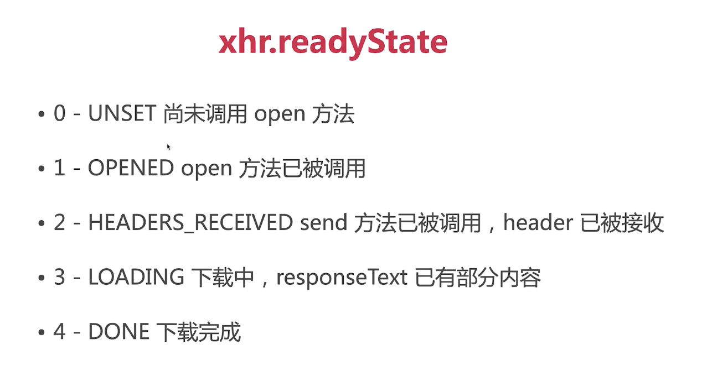
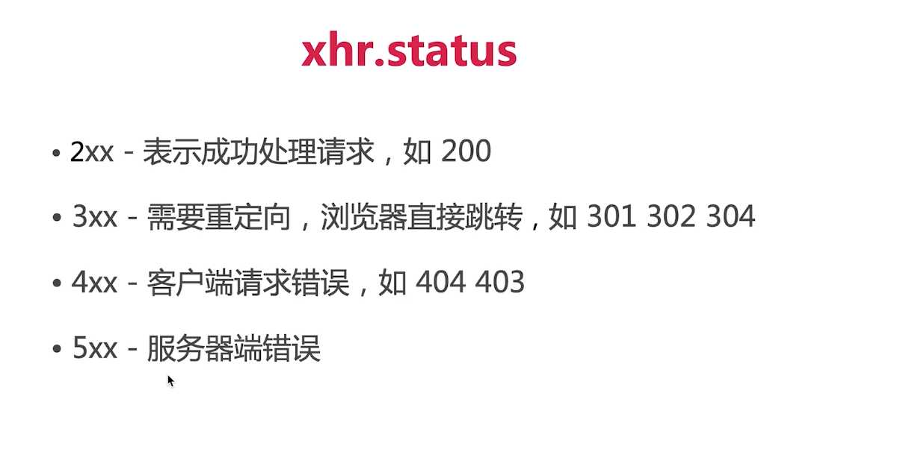

# JS-Web-API（网页操作API W3C规范）

## 1. 从JS基础知识到JS Web API

- JS基础知识，规定语法（ECMA262标准）
  - 变量类型和计算
  - 作用域和闭包
  - 原型和原型链
  - 异步和单线程
- JS Web API，网页操作的API（W3C规定）
  - DOM
  - BOM
  - 事件绑定
  - ajax
  - 存储
- 前者是后者的基础，两者结合才有应用

## 2. Web API 知识点

1. DOM
2. BOM
3. 事件绑定
4. ajax
5. 存储

### 2.1 DOM (Document Object Model)

#### 2.1.1 题目

1. DOM是哪种数据结构？
2. DOM常用api
3. attr和property的区别
4. 一次性插入多个DOM节点，考虑性能

#### 2.1.2 DOM 知识点

1. DOM本质
2. DOM节点操作
3. DOM结构操作
4. DOM性能

##### 2.1.2.1 DOM本质

##### 2.1.2.2 DOM节点操作

```js
// 获取DOM节点
const div1 = document.getElementById('div1')           //id
console.log('div1',div1)

const divList = document.getElementsByTagName('div')          //集合
console.log('divList.length',divList.length)
console.log('divList[0]',divList[0])

const containerList = document.getElementsByClassName('container')         //集合
console.log('containerList.length',containerList.length)
console.log('containerList[0]',containerList[0])

const pList1 = document.querySelectorAll('p')                  //css选择器
console.log('plist',pList1)

const pList = document.querySelectorAll('p')                  //css选择器
const p1 = pList[0]

// property形式
p1.style.width = '100px'
p1.className = 'red'
console.log(p1.style.width)
console.log(p1.className)
console.log(p1.nodeName)       //节点名字
console.log(p1.nodeType)       //1

//attribute     
p1.setAttribute('data-name','attri')
p1.setAttribute('style','font-size:50px')

```

propert 和 attibute

- property：修改对象属性，不会体现到html结构中
- attibute：修改html属性，会改变html结构
- 两者都有可能引起DOM重新渲染

##### 2.1.2.3 DOM结构操作

- 新增/插入节点 (createElement / appendChild)
- 获取子元素列表，获取父元素 (childNodes, parentNode)
- 删除子节点 (removeChild)

```js
const div1 = document.getElementById('div1')
const div2 = document.getElementById('div2')

// 新建节点
const newP = document.createElement('p')
newP.innerHTML = 'this is newP'
// 插入节点
div1.appendChild(newP)

// 移动节点
const p1 = document.getElementById('p1')
div2.appendChild(p1)

// 获取父元素
console.log( p1.parentNode )

// 获取子元素列表
const div1ChildNodes = div1.childNodes //包含标签和文本
console.log( div1.childNodes )
const div1ChildNodesP = Array.prototype.slice.call(div1.childNodes).filter(child => {  //只获取标签
    if (child.nodeType === 1) { //1为标签，3为文本
        return true
    }
    return false
})
console.log('div1ChildNodesP', div1ChildNodesP)

//删除节点
div1.removeChild( div1ChildNodesP[0] )
```

##### 2.1.2.4 DOM性能

- DOM操作非常”昂贵“，避免频繁的DOM操作
- 对DOM查询做缓存
- 将频繁操作改为一次性操作

DOM查询做缓存

```js
// 不缓存 DOM 查询结果
for (let = 0; i < document.getElementByTagName('p').length; i++){
  // 每次循环，都会计算length，频繁进行 DOM 查询
}

// 缓存 DOM 查询结果
const pList = document.getElementByTagName('p')
const length = pList.length
for (let = 0; i < length; i++){
  // 缓存 length, 只进行一次 DOM 查询  
}
```

将频繁操作改为一次性操作

```js
const listNode = document.getElementById('list')

//创建一个文档片段，此时还没有插入到 DOM 树中
const frag = document.createDocumentFragment()

// 执行插入
for (let x = 0; x < 10; X++){
  const li = document.createElement("li")
  li.innerHtml = "List item" + x
  frag.appendChild(li)
}

// 都完成之后，再插入到 DOM树中
listNode = appendChild(frag)
```

### 2.2 BOM (Browser Object Model)

题目：

1. 如何识别浏览器的类型？
2. 分析拆解url各个部分

知识点：

1. navigator
2. screen
3. location
4. history

#### 2.2.1 navigator

```js
const ua = navigator.userAgent //获取设备名称
const isChrome = ua.indexOf('Chrome')
console.log(isChrome)
```

#### 2.2.2 screen

```js
console.log(screen.width) //屏幕宽度
console.log(screen.height) //屏幕高度
```

#### 2.2.3 location

```js
console.log(location.href) //整个网址
console.log(location.protocol) //协议：'http'，'https'
console.log(location.host) //域名
console.log(location.search) // 查询参数
console.log(location.hash) // #后面的内容
console.log(location.pathname) // 路径：'/learn/199'
```

#### 2.2.4 history

```js
history.back() // 后退
history.forward() // 前进
```

### 2.3 事件

题目：

1. 编写一个通用的事件监听函数
2. 描述事件冒泡的流程
3. 无限下拉的图片列表，如何监听每个图片的点击？

知识点：

1. 事件绑定
2. 事件冒泡
3. 事件代理

#### 2.3.1 事件绑定

```js
const btn = document.getElementById('btn')
btn.addEventListener('click',event => {
  console.log('clicked')
})
```

封装事件绑定函数

```js
//通用的事件绑定函数
function bindEvent(elem, type, fn) {
    elem.addEventListener(type, fn)
}

const btn1 = document.getElementById('btn1')
bindEvent(btn1, 'click', function (event) {
    console.log(event.target) // 获取触发的元素
    event.preventDefault() // 阻止默认行为
    alert(this.innerHTML)
})
```

#### 2.3.2 事件冒泡

```html
<body>
    <div id="div1">
        <p id="p1">激活</p>
        <p id="p2">取消</p>
        <p id="p3">取消</p>
        <p id="p4">取消</p>
    </div>
    <div id="div2">
        <p id="p5">取消</p>
        <p id="p6">取消</p>
    </div>
</body>
```

```js
//通用的事件绑定函数
function bindEvent(elem, type, fn) {
    elem.addEventListener(type, fn)
}

const p1 = document.getElementById('p1')
const body = document.body
bindEvent(p1, 'click', event => {
    event.stopPropagation() // 阻止冒泡，可以注释掉这一行，来体验事件冒泡
    console.log('激活')
})
bindEvent(body, 'click', event => {
    console.log('取消')
})
```

#### 2.3.3 事件代理

- 代码简洁
- 减少浏览器内存占用
- 但是，不要滥用

```html
<div id="div3">
    <a href="#">a1</a><br>
    <a href="#">a2</a><br>
    <a href="#">a3</a><br>
    <a href="#">a4</a><br>
    <button>加载更多...</button>
</div>
```

```js
//通用的事件绑定函数
function bindEvent(elem, type, fn) {
    elem.addEventListener(type, fn)
}

// 代理绑定
const div3 = document.getElementById('div3')
bindEvent(div3,'click',event => {
    event.preventDefault()
    const target = event.target
    if (target.nodeName === 'A') {
        alert(target.innerHTML)
    }
})
```

#### 2.3.4 通用事件绑定函数升级（包括普通绑定和代理绑定）

```js

function bindEvent(elem, type, selector, fn) {
    if (fn == null) {   // 判断参数是3个还是4个，3个的话，转化成4个
        fn = selector
        selector = null
    }
    elem.addEventListener(type, event => {
        const target = event.target
        if (selector) {  //selector有值的话，肯定是4个参数，4个参数的就是代理绑定
            // 代理绑定
            if (target.matches(selector)) { //判断是否为指定选择器字符串
                fn.call(target, event)  //fn.call 是为了让 this指向的对象是target
            }
        } else {
            // 普通绑定
            fn.call(target, event)
        }
    })
}

const btn1 = document.getElementById('btn1')
const div3 = document.getElementById('div3')
// 普通绑定
bindEvent(btn1, 'click', function (event) {
    event.preventDefault()
    alert(this.innerHTML)
})
// 代理绑定
bindEvent(div3, 'click', 'a', function (event) {
    event.preventDefault()
    alert(this.innerHTML)
})
```

>tips
>>Element.matches(): 如果元素被指定的选择器字符串选中，则返回true，否则返回false。

target | selector | return
-| - | -
`<a><a/>` | a | true
`<Button><Button/>` | a | false

### 2.4 ajax

题目：

1. 手写一个简易的ajax [A](./2.4.1-%E6%89%8B%E5%86%99ajax.js)
2. 跨域的常用实现方法

知识点：

1. XMLHttpRequest
2. 状态码
3. 跨域：同源策略，跨域解决方案

#### 2.4.1 XMLHttpRequest

ajax 的核心API- XMLHttpRequest

```js
// 实现ajax get请求
const xhr = new XMLHttpRequest()
xhr.open('GET', './data/test.json', true)  // open(方法，地址，是否开启异步)
xhr.onreadystatechange = function () {
    if (xhr.readyState === 4) {
        if (xhr.status === 200) {
            console.log(
                JSON.parse(xhr.responseText) //转为JSON对象
            )
        }
    }
}
xhr.send(null)
```

```js
// post请求
const xhr = new XMLHttpRequest()
xhr.open('POST', '/login', true)
xhr.onreadystatechange = function () {
    if (xhr.readyState === 4) {
        if (xhr.status === 200) {
            console.log(
                JSON.parse(xhr.responseText)
            )
        }
    }
}
const postData = {
  name:'wxk'
  password:'xxx'
}
xhr.send(JSON.stringify(postData)) //转为JSON字符串
```

#### 2.4.2 状态码




#### 2.4.3 跨域

- 什么是跨域（同源策略）
- JSONP
- CORS（服务端支持）

同源策略：

- ajax请求时，浏览器要求当前网页和server必须同源（安全）
- 同源指：协议，域名，端口，三者必须一致
- 前端：<http://a.com:8080>,server:<https://b.com/api/xxx>, 三者都不一致了

加载图片，CSS，JS可无视同源策略

- ``
- `<link href = 跨域的css地址 />`
- `<script src = 跨域的js地址 ></script>`
- `` 可用于统计打点，可使用第三方统计服务
- `<link /> <script>` 可使用CDN，CDN一般都是外域
- `<script>`可实现JSONP

跨域：

- 所有的跨域，都必须经过server端与许和配合
- 未经server端允许就实现跨域，说明浏览器有漏洞，危险信号

JSONP

- `<script>` 可绕过跨域限制
- 服务器可以任意动态拼接数据返回
- 所以，`<script>`就可以获取跨域的数据，只要服务端愿意

jsonp.js:

```js
abc(
    { name: 'xxx' }
)
```

jsonp.html:

```html
<script>
    window.abc = function (data) {
        console.log(data)
    }
</script>
<script src="http://localhost:8002/jsonp.js?username=xxx&callback=abc"></script>
```

jQuery 实现 jsonp

```js
$.ajax({
    url: 'http://a.com/data.json',
    dataType: 'jsonp',
    jsonpCallback: 'callback',
    success: function (data){
        console.log(data)
    }
})
```

CORS - 服务器设置 http header

```js
//第二个参数填写允许跨域的域名称，不建议直接写“*”
response.setHeader("Access-Control-Allow-Origin","http://localhost:8011")
response.setHeader("Access-Control-Allow-Headers","X-Requested-With")
response.setHeader("Access-Control-Allow-Methods","PUT,POST,GET,DELETE,OPTIONS")

//接收跨域的cookie
response.setHeader("Access-Control-Allow-Creaentials","true")
```

### 2.5 存储

题目：

1. 描述cookie，localStorage sessionStorage的区别？

> A：容量，API易用性，是否会同http发送

知识点：

1. cookie
2. localStorage 和 sessionStorage

#### 2.5.1 cookie

- 本身用于浏览器和server通许
- 被借用到到本地存储
- 可用document.cookie = '',来修改

因为被借用。所以cookie存储缺点明显

- 存锤大小，最大4kb
- http请求时需要发送到服务器，增加请求数据量
- 只能用document.cookie = '', 来修改，太简陋

#### 2.5.2 localStorage 和 sessionStorage

- HTML5专门为存储而设计，最大可存5M
- API简单易用，setItem，getItem
- 不会随着http请求被发送出去
- localStorage：永久存储，除非手动删除
- sessionStorage：存于当前会话，浏览器关闭则清空
