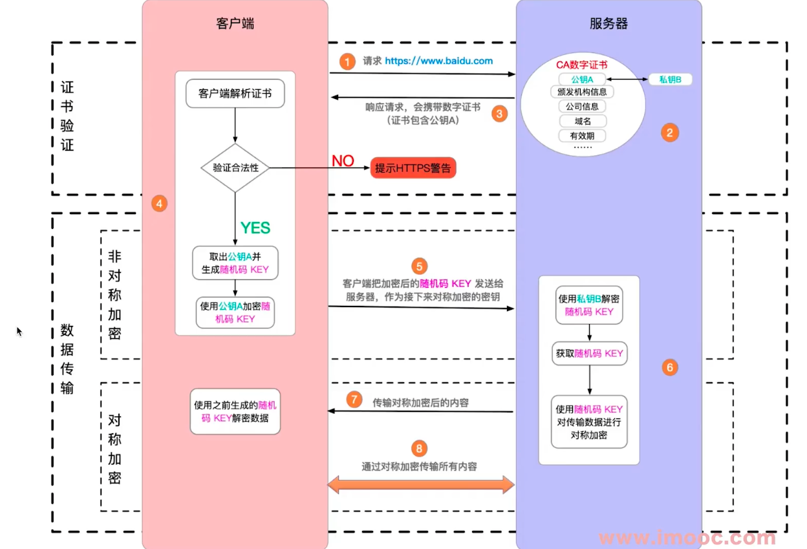

# http

题目

1. http常见的状态码有哪些？
2. http常见的header有哪些？
3. 什么是Restful API？
4. 描述一下http的缓存机制。

知识点

1. http 状态码
2. http methods
3. http headers
4. http缓存
5. https

## 1. http 状态码

1. 状态码分类
2. 常见状态码
3. 关于协议和规范

### 1.1 状态码分类

- 1xx服务器收到请求
- 2xx请求成功，如200
- 3xx重定向，如302
- 4xx客户端错误，如404
- 5xx服务端错误，如500

### 1.2 常用状态码

- 200 成功
- 301 永久重定向（配合location，浏览器自动处理）（老网站不用了，跳到新网址）
- 302 临时重定向（配合location，浏览器自动处理）（百度搜索后的页面都是302，跳到实际页面）
- 304 资源未被修改
- 404 资源未找到
- 403 没有权限
- 500 服务器错误
- 504 网关超时

### 1.3 关于协议和规定

- 不要违反规范，例如IE浏览器

## 2. http methods

1. 传统的methods
2. 现在的methods
3. Restful API

### 2.1 传统的methods

- get 获取服务器的数据
- post 向服务器提交数据
- 简单的网页功能，就这两个操作

### 2.2 现在的methods

- get 获取数据
- post 新建数据
- patch/put 更新数据
- delete 删除数据

### 2.3 Restful API

- 一种新的API设计方法
- 传统API设计：吧每个url当作一个功能
- Restful API：把每个url当作一个唯一的资源

### 2.4 用method表示操作类型

传统API设计| Restful API
-| -
post请求：/api/create-blog| post请求：/api/blog
post请求：/api/update-blog?id=100| patch请求：/api/blog/100
get请求：/api/get-blog?id=100| get请求：/api/blog/100

## 3. http headers

### 3.1 Request Headers

- Accept 浏览器课接收的数据格式
- Accept-Encoding 浏览器课接收的压缩算法，如gzip
- Accept-Language 浏览器可接收的语言，如zh-CN
- Cache-Control 控制缓存时效性
- Connection 链接方式，如是keep-alive，一次TCP链接重复使用
- Host http访问使用的域名
- If-Modified-Since 上次访问时的更改时间，如果服务器认为此时间后自己没有更新，则给出304响应
- If-None-Match 上次访问时使用的E-tag，通常是页面的信息摘要，这个比更改时间更准确一些
- User-Agent（简称UA）浏览器信息
- cookie 客户端存储的cookie字符串
- Content-type 发送数据的格式，如application/json

### 3.2 Response Headers

- Content-type 返回数据的格式，如application/json
- Content-legth 返回数据的大小，多少字节
- Content-Encoding 返回数据的压缩算法，如gzip
- Set-Cookie 设置cookie，可以存多个
- Cache-Control 缓存控制，用于通知缓存保存的时间，如max-age=0，表示不要缓存
- Connection 链接类型，如keep-alive表示复用
- Date 当前服务器时间
- ETag（资源唯一标识，类似指纹）页面信息摘要，判断是否重新取回页面
- Expires 过期时间，用于判断下次请求是否需要到服务器端取回页面
- keep-alive 保持连接不断时需要的信息，如timeout=5，max=100
- Last-Modified 页面上次修改时间（资源的最后修改时间）
- Server 服务器软件类型
- Via 服务器的请求链路

## 4. http 缓存

### 4.1 http缓存策略（强制缓存 + 协商缓存）

#### 4.1.1 强制缓存

cache-control 设置的时间过期后

cache-control 的值

- max-age 设置过期时间
- no-cache 不用缓存
- no-store 不用本地缓存，也不用服务端的缓存
- private 只允许最终用户缓存
- public 允许中间代理缓存

> 关于Expires

- 同在Response Headers中
- 同为控制缓存过期
- 已被Cache-Control替代

#### 4.1.2 协商缓存（对比缓存）

- 服务端缓存策略
- 服务端判断客户端资源，是否和服务端资源一样
- 一致返回304，否则返回200和最新的资源

资源标识

- Last-Modified 资源的最后修改时间
- Etag 资源的唯一标识（一个字符串，类似人类指纹）

Last-Modified

Etag

Headers 示例

Last-Modified 和 Etag

- 会优先使用Etag
- Last-Modified 只能精确到秒级
- 如果资源被重复生成，而内容不变，则Etag更精确

http缓存-综述

### 4.2 刷新操作方式，对缓存的影响

三种刷新操作

- 正常操作：地址栏输入url，跳转链接，前进后退等
- 手动刷新：F5，点击刷新按钮，右击菜单刷新
- 强制刷新：`ctrl`+`F5`

不同的刷新操作，不同的缓存策略

操作| 强制缓存| 协商缓存
-| -| -
正常| 有效 | 有效
手动| 失效 | 有效
强制| 失效 | 失效

## 5. https

1. http和https
2. 加密方式：对称加密，非对称加密
3. https证书

### 5.1 http和https

- http是明文传输，敏感信息容易被中间劫持
- https = http + 加密，劫持了也无法解密
- 现在浏览器已开始强制https协议

### 5.2 加密方式

- 对称加密：一个key同时负责加密，解密
- 非对称加密：一对key，公钥加密之后，只能用私钥来解密（私钥只放在服务器）
- https 同时用了这两种加密方式（成本低）

### 5.3 https证书

- 中间人攻击
- 使用第三方证书（慎用免费，不合规的证书）
- 浏览器校验证书

### 5.4 https过程解析

