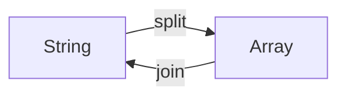

# 5. split() 和 join() 的区别？ [AQ](./00-question.md)

- split() 字符串转变为数组
- join() 数组转变为字符串

```javascript
'1-2-3'.split('-')    //[1, 2, 3]
[1, 2, 3].join('-')   //'1-2-3'
```


```mermaid
flowchart LR
    String --split-->Array
    Array --join-->String
```
