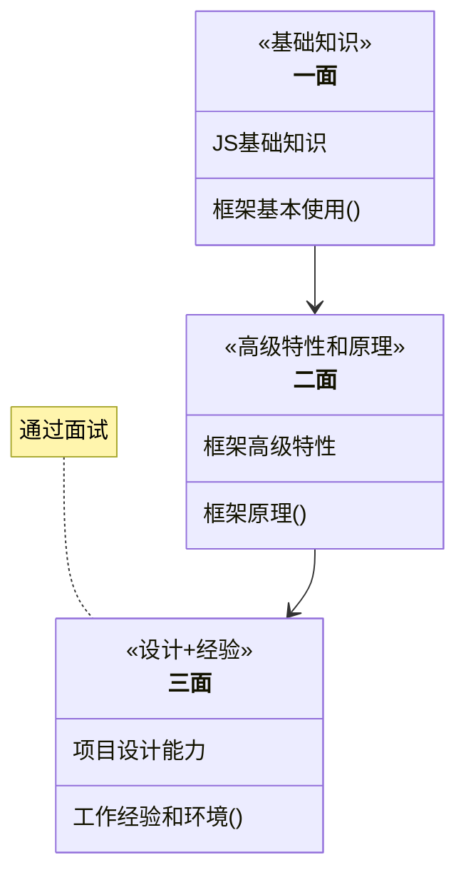

# 框架面试导学

## 前端常见面试流程

## 知识点介绍

- Vue
  - 基本使用
  - 高级特性
  - 原理
- React
  - 基本使用
  - 高级特性
  - 原理
- 工具面试
  - Webpack配置
  - 性能优化
  - babel
- 项目设计
  - 状态设计
  - 组件设计
  - 组件通讯

## 框架的学习

1. 框架的使用
    - 基本使用
    - 高级特性
    - 周边插件
2. 框架的原理
    - 基本原理的了解
    - 热门技术的深度
    - 全面性
3. 框架的实际应用，即设计能力
    - 组件结构
    - 数据结构

## Vue

1. v-show v-if的区别
2. 为何v-for中要使用key
3. 描述Vue组件生命周期（有父子组件的情况）
4. Vue组件如何通讯
5. 描述组件渲染和更新的过程
6. 双向数据绑定v-model的实现原理

## React

1. React组件如何通讯
2. JSX本质是什么
3. context是什么，有何用途
4. shouldComponentUpdate的用途
5. 描述redux单项数据流
6. setState是同步还是异步（场景题）

## 框架综合应用

1. 基于React设计一个todolist（组件结构，redux state数据结构）
2. 基于Vue设计一个购物车（组件结构，vuex，state数据结构）

## webpack

1. 前端代码为何要继续构建和打包
2. module chunk bundle分别什么意思，有何区别
3. loader 和 plugin 的区别
4. webpack 如何实现懒加载
5. wbepack 常见性能优化
6. babel-runtime 和 babel-polyfil的区别

## 框架的考察

- 保证候选人能正常工作---考察使用
- 多个候选人竞争时，选择有技术追求的---考察原理
- 看候选人是否能独立承担项目---考察设计能力

## Vue 和 React 越来越接近

- Vue3 Options API 和 React class Component
- Vue3 Composition API 和 React Hooks
